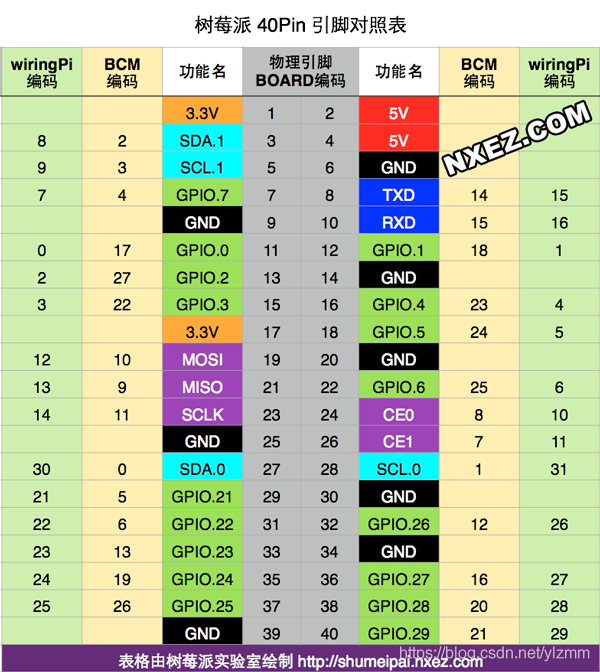
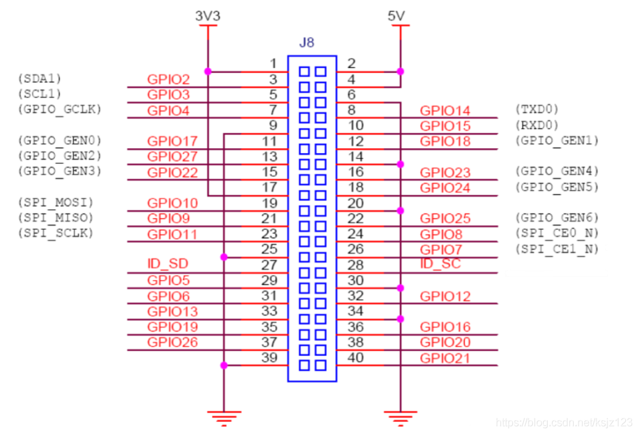

#### i2c Oled
- 开启i2c: sudo raspi-config
- Luma.oled库 [Luma api](https://luma-oled.readthedocs.io/en/latest/api-documentation.html) [教程1](https://blog.csdn.net/qq_46476163/article/details/116395514)
- TODO

### RPi.GPIO
- https://pypi.org/project/RPi.GPIO/
- 通过 gpio readall 查看引脚信息
- 安装或更新gpio命令：wget https://project-downloads.drogon.net/wiringpi-latest.deb \ sudo dpkg -i wiringpi-latest.deb

####GPIO引脚用途
在这个40Pin管脚中，除了12个电源类外，其余28个都是可编程的GPIO，其中部分GPIO可以复用为IIC，SPI，UART，PWM等等，可以用来驱动各种外设。

I2C是由Philips公司开发的一种简单、双向二线制同步串行总线。它只需要两根线即可在连接于总线上的器件之间传送信息。树莓派通过I2C接口可控制多个传感器和组件。它们的通信是通过SDA(数据引脚)和SCL(时钟速度引脚)来完成的。每个从设备都有一个唯一的地址，允许与许多设备间快速通信。ID_EEPROM引脚也是I2C协议，它用于与HATs通信。

SPI是串行外设接口，用于控制具有主从关系的组件，采用从进主出和主进从出的方式工作，树莓派上SPI由SCLK、MOSI、MISO接口组成，SCLK用于控制数据速度，MOSI将数据从树莓派发送到所连接的设备，而MISO则相反。

有使用Arduino的朋友一定听说过UART或Serial，通用异步收/发器接口用于将Arduino连接到为其编程的计算机上，也用于其他设备与 RX 和 TX 引脚之间的通信。如果树莓派在 raspi-config 中启用了串口终端，则可以使用这些引脚通过电脑来控制树莓派，也可以直接用于控制Arduino。

在树莓派上，所有的引脚都可以实现软件PWM，而GPIO12、GPIO13、GPIO18、GPIO19可以实现硬件脉宽调制。
